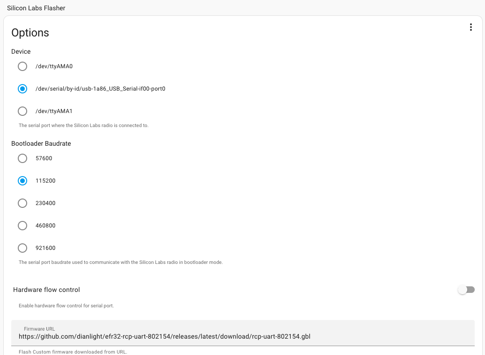
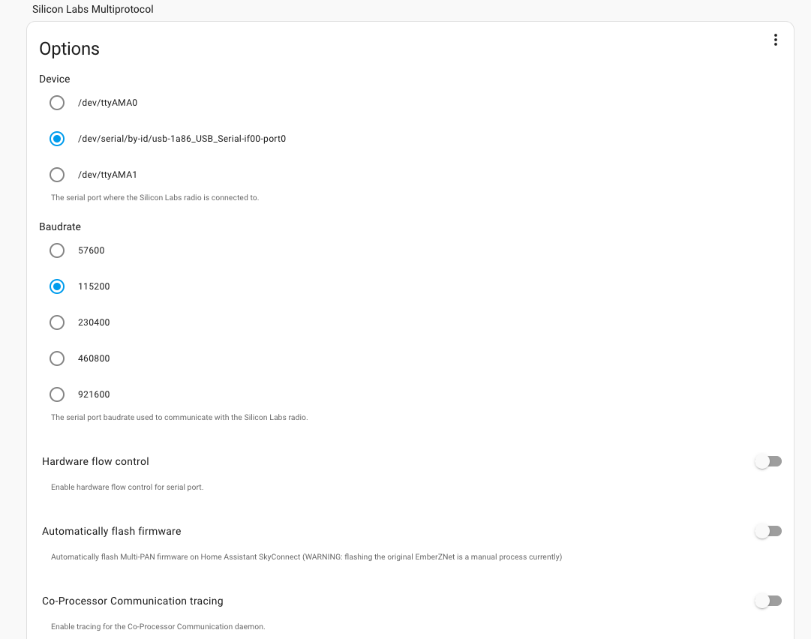

# Multiprotocol (OpenThread+Zigbee) RCP

This multiprotocol radio co-processor (RCP) application supports running OpenThread and Zigbee stacks simultaneously on a host processor. It uses concurrent multiprotocol (CMP) / multi-PAN functionality to run the 802.15.4 networks simultaneously on the same channel.

The host stacks and the RCP communicate using the Co-Processor Communication protocol (CPC), which acts as a protocol multiplexer and serial transport layer. The host applications connect to the CPC daemon, which in turn connects to the EFR via a SPI or UART link.

Refer to *AN1333: Running Zigbee, OpenThread, and Bluetooth Concurrently on a Linux Host with a Multiprotocol Co-processor* for more information on running the multiprotocol RCP with different host applications.

This is a simple repository to generate the MultiPAN flash to allow using efr32mg21-based low-cost Chinese dongles in HomeAssistant with the Silicon Labs Multiprotocol and Silicon Labs Flasher Addon

## [Silicon Lab Flasher](https://github.com/home-assistant/addons/tree/master/silabs_flasher)

Configure as Below:



 - Baudrate: 115200
 - Hardware flow control: no
 - Firmware URL: https://github.com/dianlight/efr32-rcp-uart-802154/releases/latest/download/rcp-uart-802154.gbl

## [Silicon Lab Multiprotocol](https://github.com/home-assistant/addons/tree/master/silabs-multiprotocol)

Configure as Below:



 - Baudrate: 115200
 - Hardware flow control: no
 - Automatically flash Firmware: no

## Release procedure with github actions

Simple step to update and release a new version.
- Use Simplicity Studio to update and corret Gecko SDK to desidered version
- Test the makefile with the shell command: 
- Commit the modify with emote type
  ```
   ✨ feat (geckosdk): Update to versione 4.3.1
  ```
- Update CI file .github\workflow\build.yaml env 
 ```yaml
 env:
  GECKO_VERSION: "4.3.1"
  COMMANDER_VERSION: "1v15p3b1357"
```
- Commit with message `Release: <semver>` and push


